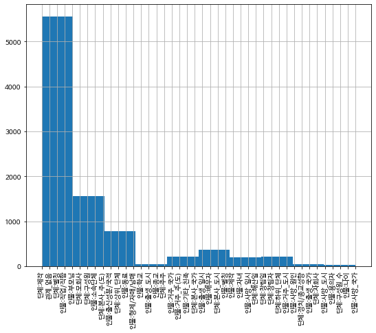
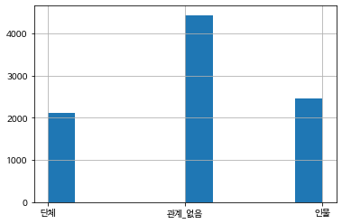
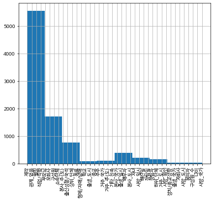
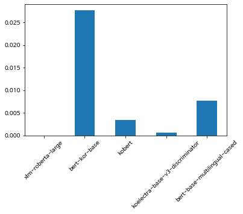
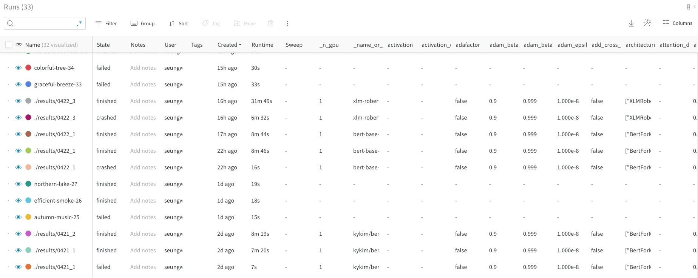
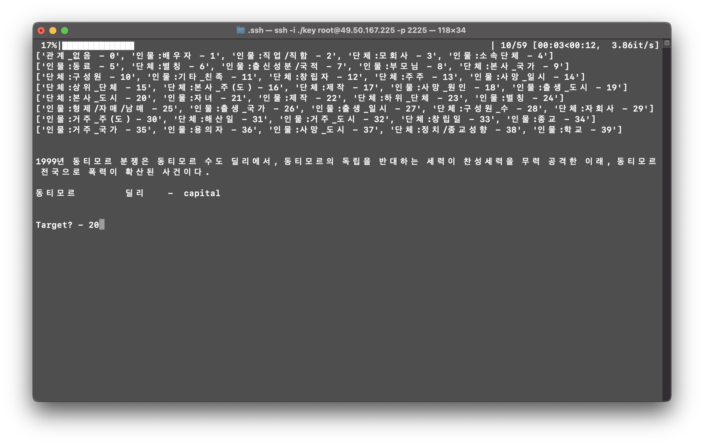
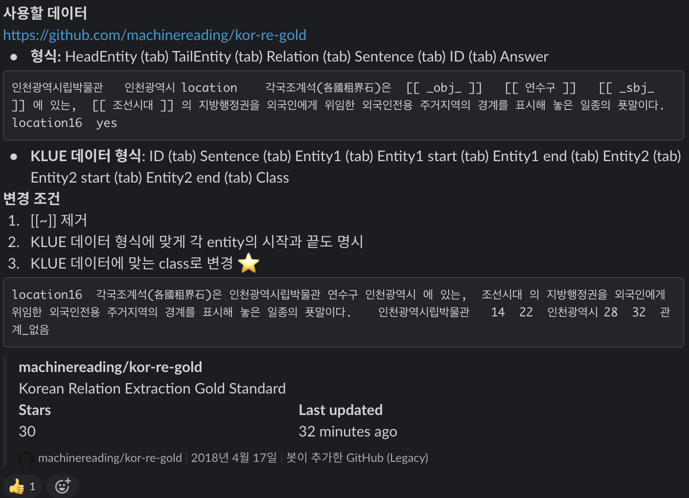

# [Stage 2] Wrap-up Report

**홍승우 T1226**

*April, 2021 - Boostcamp AI Tech*

---

## 📂 문제 정의와 데이터셋

두번 째 대회는 문장에서 두 객체 간의 관계를 문장으로 부터 미리 정의된 42개 (관계 없음 포함) 의 클래스로 분류 하는 문제 였다. 대회 기간은 약 2주 였으며, 서버 환경에서 V100 GPU 1장을 사용하여 학습하였다.

- **평가 지표**
    - Accuracy

KLUE 데이터셋은 총 9천개의 학습 데이터와 1천개의 테스트 데이터로 구성되어 있었으며, csv 파일 내에 문장, 두개의 entity 그리고 그것들의 인덱스 정보가 담겨져 있었다.

---

## 📊 데이터셋의 구성에 따른 학습 전략

### Label 분포 알아보기



전체 학습 데이터 레이블 분포



첫번째 entity 의 라벨 분포



두번째 entity 의 라벨 분포

우선, 어느 때와 같이 전체 학습 데이터의 레이블 분포를 알아보며 시작. 데이터가 한개 존재하는 클래스가 존재할 만큼 클래스 불균형이 굉장히 심함을 알 수 있었다. 학습 데이터와 테스트 데이터의 분포가 비슷하다는 가정 아래, 일부 클래스를 없애 버릴 까 생각하며, 몇가지 클래스를 한줄로 찍어 제출해본 결과, 분포가 상당히 다름을 알 수 있었다. 따라서 그냥 그대로 42개의 클래스를 유지하기로 하였다.

### Entity

OIE UBS MBC NASA KT Marie ABC SPFL LVMH A KCC IOC KCC 慶應 黃皓 Benedict Cumberbatch HUG UBS Bic Metallica KGET Kerrigan EXID GD&TOP FIFA MBC KAIST SBS ICAO A CBS JTWC A SBS RCA LVMH G-Dragon UN Fairies OECD ☎ Britney A GAP MBC KIA KT&G KBS Joy ASML GNU CNN 帶原君 SKC FIFA K A MBC A ASME d THX MBC 金 EU NBA L A Kylie MIT KBS MBC LPGA 中宗 DHC LH MBC SMAP PDH A LH MLB B BTS IBM IBM UEFA JTWC MLB SMAP Key MBC SKC KT&G A EBS SBS tvN KT Seventeen KMFDM A Deze CSIS MBN MBC B LG U SBS DeNA R.E.M. Oh! MBC MBC GS SHOP UEFA mariage KBS UNM Georg Saver Tiger A SK ㈜ A FDA AEK ASAYAN A CJ BBC A YTN 4-H 李集 Metallica EBS Pile DJ DOC Concern Worldwide B*Witched S MBC ABI Mnet SBS A GKL 45RPM CJ ENM A ClariS ABBA MOU FTA A C EVISU John II Casimir BBC EXILE NERIT ANU UBS A NASA EBS UN USL KT 李址鎔 SBS LH AKA of CN WTO RCA EASD GS SHOP IMO CNN LIG IAEA GNU BMW OCN Taylor Swift Vaynerchuk NBC A KBS2 EG A A A MBC USCG MBC 竇武 丸彫 of PRASAC A NPT B Mr.Children EXID MBC Suede tvN BPA A AKA A EBS KT&G MBC 李福男 KBS 

위 텍스트는 관계를 찾아내야할 entity 들 중, 한글이 포함되지 않은 entity 들을 출력한 것의 일부다. 한글이 아닌것과 특수문자를 정제해야 하나 고민되어 확인해본 결과,  많은 특수문자와 영어, 한문 등이 관계를 예측해야할 entity 들에 포함되어 있어, 이 부분에 대한 제거를 하면 안되겠다는 결정을 하였다.

---

## ✂️ Tokenizer 비교하기

```python
# xlm-roberta-large
['▁심', '상', '정', '▁정의', '당', '▁대표', '는', '▁21', '일', '▁"', '국민', '들', '께', '선', '▁이번', '▁총', '선', '에서', '▁지지', '부', '진', '한', '▁정치', '권', '의', '▁이', '합', '집', '산', '과', '▁', '꼼', '수', '정치', '를', '▁심', '판', '하고', '▁진', '정', '한', '▁정치', '혁명', '의', '▁길을', '▁열', '어', '▁달라', '"', '고', '▁말했다', '.']

# kykim/bert-kor-base
['심상', '##정', '정의', '##당', '대표는', '21일', '[UNK]', '국민', '##들께', '##선', '이번', '총선', '##에서', '지지', '##부', '##진한', '정치권', '##의', '이', '##합', '##집', '##산과', '꼼', '##수정', '##치를', '심판', '##하고', '진정한', '정치', '##혁명', '##의', '길을', '열어', '달라', '[UNK]', '고', '말했다', '.']

# monologg/kobert
['▁심', '상', '정', '▁정', '의', '당', '▁대표는', '▁21', '일', '▁"', '국민', '들', '께', '선', '▁이번', '▁총', '선', '에서', '▁지지', '부', '진', '한', '▁정치권', '의', '▁이', '합', '집', '산', '과', '▁', '꼼', '수', '정치', '를', '▁심판', '하고', '▁진', '정', '한', '▁정치', '혁명', '의', '▁길', '을', '▁열어', '▁달라', '"', '고', '▁말했다', '.']

# monologg/koelectra-base-v3-discriminator
['심상정', '정의당', '대표', '##는', '21', '##일', '"', '국민', '##들', '##께', '##선', '이번', '총선', '##에', '##서', '지지부진', '##한', '정치', '##권', '##의', '이', '##합', '##집', '##산', '##과', '꼼수', '##정', '##치', '##를', '심판', '##하', '##고', '진정', '##한', '정치', '##혁명', '##의', '길', '##을', '열', '##어', '달라', '"', '고', '말', '##했', '##다', '.']

# bert-base-multilingual-cased
['심', '##상', '##정', '정', '##의', '##당', '대', '##표', '##는', '21일', '"', '국', '##민', '##들', '##께', '##선', '이', '##번', '총', '##선', '##에서', '지', '##지', '##부', '##진', '##한', '정', '##치', '##권', '##의', '이', '##합', '##집', '##산', '##과', '꼼', '##수', '##정', '##치를', '심', '##판', '##하고', '진', '##정한', '정', '##치', '##혁', '##명의', '길', '##을', '열', '##어', '달', '##라', '"', '고', '말했다', '.']
```



전체 토큰 대비 UNK 토큰 비율

[UNK] 토큰이 많이 나온다면, 성능이 좋지 않을 것 같아, 각 토크나이저 별로, 학습 데이터 에서의 전체 토큰 대비 UNK 토큰 비율을 확인해 보았다. 0% ~ 2.5% 로 큰 성능차를 보이진 않았다. RoBERTa 에서, [UNK] 토큰의 비율이 0% 가 나왔다는데, BPE 가 사용된 토크나이저의 장점이라고 할 수 있을것 같다.

---

## 🛢 Training Pipeline

자연어 처리 공부를 본격적으로 시작하며, Huggingface 🤗  라이브러리와 친해져 보려는 노력을 많이 한 것 같다. 처음 Huggingface 를 접했을 땐, 너무 high-level 로 래핑 되어 있는 느낌이 없지 않아 거부감이 들기도 했지만, 현업 에서 또한 많이 사용된다 하여 적극적으로 사용해보기로 했다. 대회 초 제공받은 Huggingface 베이스라인 코드를 많이 참고하며 documentation 을 읽으며 필요한 부분을 수정하여 코드를 작성하였다.

사용 할수록 원하는 기능은 대부분 포함되어 있고 매우 간단하게 학습을 진행할 수 있어 본 대회중에는 모두 Trainer 를 사용하였다.

### Argparser & JSON Config

```bash
python train.py --config config1
python inference.py --config config1 --wandb_version run-.results0422_4:v0 --path /opt/ml/input/data/test/test.tsv
```

지난 대회에서 다음 번엔 argparser 를 이용한 python project 를 적극적으로 사용하자는 스스로의 약속을 지킬 수 있었다. 전처리는 쥬피터 노트북에서 반응형으로 결과를 확인해 보며 작업하여 tsv 파일을 따로 저장해 주어 호출하는 방식을 택하였다.

하이퍼 파라미터 관리를 편하게 하기 위해, 여러 configuration 을 json 파일을 만들어 따로 관리했다.

```json
{
    "train_id_name": "0422_3",
    "model_name": "xlm-roberta-large",
    "train_data_path": "/opt/ml/input/data/train/train_no_ner.tsv",
    "valid_data_path": "/opt/ml/input/data/train/valid_no_ner.tsv",
    "train_args": {
        "save_total_limit": 2,
        "save_steps": 100,
        "num_train_epochs": 100,
        "learning_rate": 1e-5,
        "per_device_train_batch_size": 32,
        "per_device_eval_batch_size": 32,
        "warmup_steps": 300,
        "weight_decay": 0.01,
        "logging_dir": "./logs",
        "logging_steps": 100,
        "evaluation_strategy": "steps",
        "eval_steps": 100,
        "dataloader_num_workers": 4,
        "label_smoothing_factor": 0.5,
        "load_best_model_at_end": "True"
    },
    "early_stopping_patience": 10
}
```

### WANDB



Wandb 역시, 지난 번 랜덤 피어세션에서 만난 분에게 영업(?) 을 당하여 다음번엔 꼭 사용해보자고 생각한 프로젝트 관리툴 이었다. 모델 또한 100기가 까지 저장할 수 있는게 정말 편리한 것 같았다. 주로 best 모델을 저장하고, inference 시 wandb 서버에서 로드하여 사용하는 방법을 사용했다. 덕분에 이번 대회에서 이슈 였던 용량 관리의 문제에서 고통받지 않을 수 있었다.

---

## ⚙️ 데이터 제작

> [https://github.com/machinereading/kor-re-gold](https://github.com/machinereading/kor-re-gold)

피어세션의 팀원들과 슬랙에 올라왔던 위의 데이터셋을 우리 대회 형식에 맞게 각자 파트를 나눠 작업 하기로 했다.



간단하게 annotation tool 을 만들어 라벨링 효율을 높여 보았다.



팀에서 룰을 정해 작업

직접 RE 라벨링을 진행해보니, 결코 쉬운 작업이 아니었다. 배경 지식을 이용하면 쉽게 두 단어간의 연관성을 유추할 수 있지만, 그 관계를 온전히 문맥 상에서 추론이 가능한지 여부 또한 판단해야 했었다. 팀원 각자 작업한 파트를 모아 결과적으로 약 260 여 개의 데이터를 추가로 얻을 수 있었다.

---

## 🧩 여러가지 시도들

~~리더보드에 올렸던 점수들을 모두 기록한 시트가 날아가는 바람에.. 모델별 리더보드 점수 변동폭을 리포트에 기록할 수 없었다..~~


### NER Tagging

그러나 다른 도시들은 여러 측면에서 잘 방어되었고, [CITY] 됭케르크 [/CITY]를 제외한 여러 도시들은 [ORGANIZATION] 연합군 [/ORGANIZATION]과 독일군 사이의 치열한 전투 끝에 탈환되었다.

- Pororo 라이브러리 사용
- 관계를 찾아야 하는 entity 에 해당하는 NER 태그를 얻어 앞 뒤에 붙여 기록
- ~~잘못 사용한 부분을 대회가 끝나고 알게되었다. Special token 으로 등록해줘야한다고 생각했는데 추가하지 않고 학습하는 것이 옳은 방법이라고 한다.~~

### Entity Tagging

그러나 다른 도시들은 여러 측면에서 잘 방어되었고, [E2] 됭케르크 [/E2]를 제외한 여러 도시들은 [E1] 연합군 [/E1]과 독일군 사이의 치열한 전투 끝에 탈환되었다.

⇒ 위 두 방법은, 모델에게 학습에 관련한 정보를 좀 더 상세히 제공한다면 학습 성능이 올라갈 것이라는 접근에서 진행하게 되었다.

⇒ 결과적으로 NER, entity tagging 두 방법 모두 성능이 향상되지 않았다. 내려가지도 않았던 것을 보면, 두 방법이 크게 학습에 영향을 미치지 않은 것 같기도 했다.

### Translation

- Pororo 라이브러리 사용
- 데이터 증강을 위해 back translation 을 시도해 보다, 처리 시간이 너무 길어 시도한 방법
- 한국어 nlp 문제가 영어의 그것보다 어려운 문제를 갖는다 생각하여, 번역 성능이 어느정도 나와주는 상황에서 **영어 문장에서의 RE 로 문제를 바꾸어 해결**하려 했다.
- 대회 막판에 급하게 시도한 방법이라 전처리 등을 신경쓰지 못해 성능향상을 이끌어낼 수 없었던것 같다.

### Model Selection

- Backbone 모델을 바꿀 때 점수가 가장 크게 올랐다.
- 초반에는 데이터 수가 적어 큰 모델을 돌릴 필요가 있을까 생각하여 kobert, koelectra 위주로 학습하였다.
- 최종적으론 xlm roberta large 모델을 사용하게 되었다. 뒷 문장 예측 task 가 없어진 모델이었기 때문에 token type ids 를 모델로 넘겨줄 필요가 없었다.

---

## 🧾 Retrospect

자연어 처리는 아직 너무 어려운것 같다. Huggingface 라이브러리와 BERT 같은 큰 모델들의 상세한 구조와 작동원리를 모두 이해한 상태가 아니어서 대회 진행에 어려움을 많이 느꼈다. 

특히, 다양한 전처리 방법을 시도했을 때 큰 효과가 없어 많은 좌절을 겪었다.

### 다음 번에 꼭 시도할 것

상위권을 달성하신 분들의 솔루션을 들어보고, 피어세션에서 솔루션을 공유한 후 cross validation 의 중요성을 알게 되었다. 사실 약간의 귀찮음과 시간을 조금 더 할애 해야 한다는 비용 대비 앙상블 까지 할 수 있으니 다음 번엔 꼭 사용해 보도록 해야겠다. 또한, 이번엔 서버 용량 문제 등을 포함 하여 학습 진행에 있어 매끄럽지 못했던 부분이 있어 모델 앙상블을 하지 못했었다. 하지만 모델 앙상블은 여전히 강력 했고, 다음 대회에선 적용하도록 해야겠다.

자연어 전처리를 진행하다 보니, 정규 표현식을 능숙히 사용하지 못하는 자신을 발견하였다.. 이번 부스트캠프 P 스테이지에서 자연어 처리 트랙을 밟고 있으니 점점 공부하며 익숙해질 수 있도록 해야겠다.

### 발전한 부분

지난 대회에서, 버전 관리나 학습 코드를 좀 더 다듬을 필요가 있다는 것을 느끼게 되었는데 이번 대회에서 많이 보완을 한 것 같아 그 부분에 있어서는 스스로에게 칭찬해주고 싶다.

이번 대회는 사실 자연어 처리의 여러 task 들을 강의 코드 위주로 공부하며 특히 Huggingface 라이브러리를 공부하는데 초점을 두며 아쉬운 리더보드 점수지만 자연어 처리에 본격적으로 "입문" 할 수 있는 좋은 기회 였다고 생각 한다.

주말을 이용해 이번 대회에서 직접 사용한 backbone 모델들의 구조와 특징에 대해 자세하게 공부할 예정이다. 

객체간 관계를 검출하는 task 는 단순히 대회를 넘어 QA, MRC 등의 자연어 처리 분야의 기초가 된다고 한다. 이번 대회에서 해본 많은 고민이 나아가 관심있는 자연어 분야를 공부하는데 큰 밑거름이 되었으면 좋겠다.
